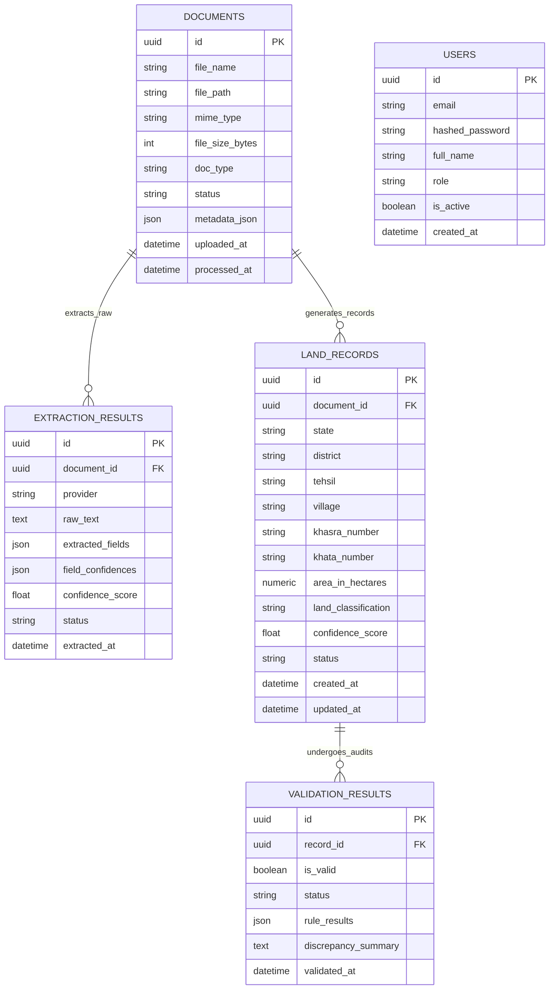

# Database Architecture — SIH26018 (Phase 2)

## 1. Database Overview

- **Engine**: PostgreSQL 15+
- **ORM**: SQLAlchemy 2.0 (Async enabled)
- **Migrations**: Alembic (`001_phase2_core_domain`)
- **Testing Driver**: `aiosqlite` (in-memory async SQLite for rapid isolated test execution)

---

## 2. Entity Relationship Diagram (Phase 2 ERD)



---

## 3. Database Entities & Constraints

### `documents`
- `id`: UUID (Primary Key)
- `file_name`: VARCHAR(255) (NOT NULL)
- `file_path`: VARCHAR(512) (NOT NULL) — relative path on storage filesystem
- `mime_type`: VARCHAR(100) (NOT NULL)
- `file_size_bytes`: INTEGER (DEFAULT 0, NOT NULL)
- `doc_type`: VARCHAR(50) (DEFAULT 'JAMABANDI', NOT NULL)
- `status`: VARCHAR(50) (DEFAULT 'UPLOADED', NOT NULL, INDEXED: `UPLOADED`, `PROCESSING`, `EXTRACTED`, `NORMALIZED`, `VALIDATED`, `FAILED`)
- `metadata_json`: JSON (extensible scanner details & metadata)
- `uploaded_at`: TIMESTAMP (NOT NULL)
- `processed_at`: TIMESTAMP (NULLABLE)

### `extraction_results`
- `id`: UUID (Primary Key)
- `document_id`: UUID (Foreign Key -> `documents.id`, ON DELETE CASCADE, INDEXED)
- `provider`: VARCHAR(50) (DEFAULT 'MOCK_OCR_V1', NOT NULL)
- `raw_text`: TEXT (NULLABLE)
- `extracted_fields`: JSON (NOT NULL) — unnormalized extracted key-value pairs
- `field_confidences`: JSON (NULLABLE) — individual field confidence ratings
- `confidence_score`: FLOAT (DEFAULT 1.0, NOT NULL)
- `status`: VARCHAR(50) (DEFAULT 'SUCCESS', NOT NULL)
- `extracted_at`: TIMESTAMP (NOT NULL)

### `land_records`
- `id`: UUID (Primary Key)
- `document_id`: UUID (Foreign Key -> `documents.id`, ON DELETE SET NULL, INDEXED)
- `state`: VARCHAR(100) (NOT NULL)
- `district`: VARCHAR(100) (NOT NULL)
- `tehsil`: VARCHAR(100) (NOT NULL)
- `village`: VARCHAR(100) (NOT NULL)
- `khasra_number`: VARCHAR(50) (NOT NULL)
- `khata_number`: VARCHAR(50) (NOT NULL)
- `area_in_hectares`: NUMERIC(10, 4) (NOT NULL, CHECK > 0)
- `land_classification`: VARCHAR(100) (DEFAULT 'Agricultural')
- `confidence_score`: FLOAT (DEFAULT 1.0)
- `status`: VARCHAR(50) (DEFAULT 'EXTRACTED', NOT NULL, INDEXED: `EXTRACTED`, `NORMALIZED`, `VALIDATED`, `FLAGGED`, `REJECTED`)
- `created_at`: TIMESTAMP (NOT NULL)
- `updated_at`: TIMESTAMP (NOT NULL)

### `validation_results`
- `id`: UUID (Primary Key)
- `record_id`: UUID (Foreign Key -> `land_records.id`, ON DELETE CASCADE, INDEXED)
- `is_valid`: BOOLEAN (NOT NULL)
- `status`: VARCHAR(50) (NOT NULL: `VALIDATED` vs `FLAGGED`)
- `rule_results`: JSON (NOT NULL) — list of individual rule evaluation reports
- `discrepancy_summary`: TEXT (NULLABLE)
- `validated_at`: TIMESTAMP (NOT NULL)

---

## 4. Applied Indexes

- `ix_land_records_location`: Composite index on `(state, district, tehsil, village)` for regional land parcel filtering.
- `ix_land_records_khasra_khata`: Composite index on `(khasra_number, khata_number)` for parcel identification.
- `ix_land_records_status`: Single index on `status` for validation status filtering.
- `ix_land_records_document_id`: Single index on `document_id` for document record aggregations.
- `ix_documents_status`: Single index on `documents.status`.
- `ix_extraction_results_document_id`: Single index on `extraction_results.document_id`.
- `ix_validation_results_record_id`: Single index on `validation_results.record_id`.

---

## 5. Migrations Workflow

Migrations are configured via `backend/alembic.ini` and stored in `database/migrations/`:

```bash
# Generate revision
cd backend
alembic revision --autogenerate -m "Add new column"

# Apply pending migrations
alembic upgrade head
```
