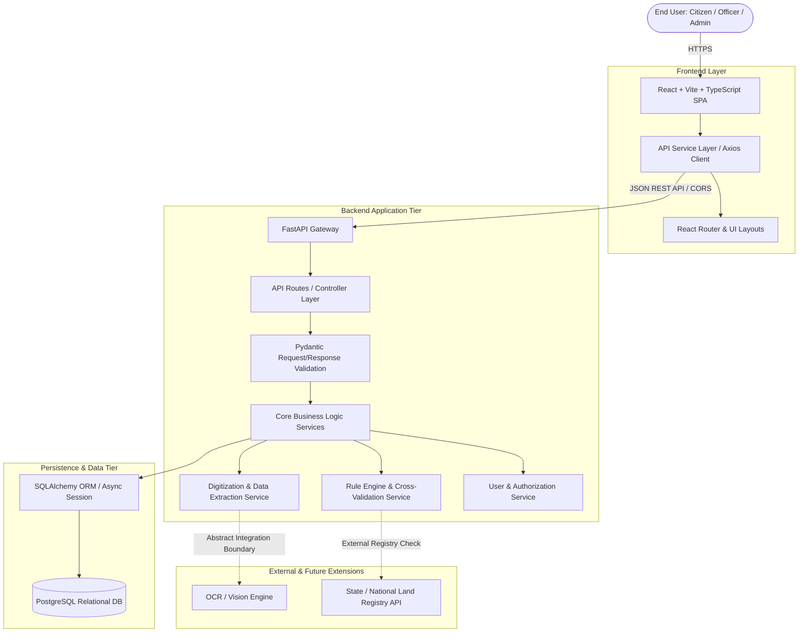

# System Architecture — SIH26018

## 1. Overview & Objectives

**SIH26018: Intelligent Land Record Digitization and Validation System** is designed for the **Ministry of Rural Development** to transform physical, handwritten, scanned, and legacy land documents (Jamabandi, Khasra, Khata, cadastral maps) into validated, structured, and search-optimized digital records.

The primary architectural goals are:
- **Strict Separation of Concerns**: Decouple User Interface, API Routing, Business Logic, Persistence, and Integration Layers.
- **Scalable Modular Design**: Enable independent expansion of optical extraction, validation rules engines, and spatial mapping modules.
- **Reliability & Auditability**: Ensure all digitized records are backed by validation logs, confidence scores, and audit trails.

---

## 2. High-Level Multi-Tier Architecture Diagram

---

## 3. Data Flow Architecture

The primary system workflow follows a clear, unidirectional data pipeline:

1. **Document Ingestion**:
   User uploads a scanned document (PDF, PNG, JPG) or legacy land record via the React UI.
2. **REST Transmission**:
   The frontend API service transmits the file via standard `multipart/form-data` to the FastAPI backend route `/api/v1/digitize/upload`.
3. **Pydantic Validation**:
   The request is validated against strict Pydantic schemas (file size, MIME type, payload parameters).
4. **Extraction Service Layer**:
   `DigitizationService` parses the document, extracts key attributes (Owner Name, Survey Number, Khasra Number, Khata Number, Area, Land Category), and computes extraction confidence scores.
5. **Cross-Validation Engine**:
   `ValidationService` runs deterministic business validation rules against existing records (e.g., area sanity checks, ownership duplicate checks, format correctness).
6. **Persistence**:
   Results are stored in PostgreSQL using SQLAlchemy ORM with clear status indicators (`PENDING_REVIEW`, `VALIDATED`, `REJECTED`).
7. **Response & UI State**:
   FastAPI returns a JSON response containing structured records and validation flags to update the React frontend state.

---

## 4. Architectural Scaffolding Principles

- **No Overengineering**: Baseline application utilizes standard FastAPI async handlers and React standard hooks.
- **Type Safety**: End-to-end type parity using TypeScript interfaces on the client and Pydantic models on the server.
- **Configuration Security**: Zero hardcoded secrets; environment variables loaded through `pydantic-settings` and Vite `import.meta.env`.
