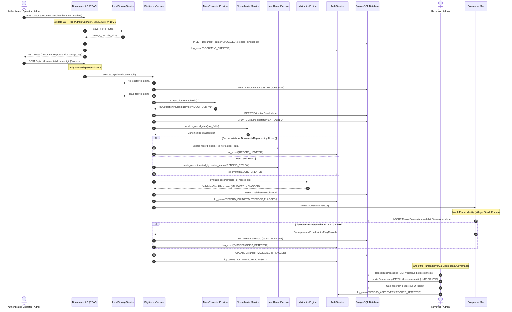

# Land Record Digitization Pipeline Specification — SIH26018 (Phase 4)

## 1. Overview

The digitization pipeline is the core processing engine of the SIH26018 platform. It converts physical land revenue records into structured, validated, and human-reviewable land records with end-to-end auditability and role-based access control.

---

## 2. Pipeline Lifecycle & Governance Stages

---

## 3. Separation of Machine Validation & Human Approval

- **Automated Validation**: Rule-based checks (`AreaSanityRule`, `KhasraFormatRule`, etc.) determine technical data consistency (`VALIDATED` vs `FLAGGED`).
- **Human Review**: Domain expert inspection determines administrative and legal validity (`PENDING_REVIEW` -> `IN_REVIEW` -> `APPROVED` or `REJECTED`).
- **Discrepancy Resolution**: Flagged records must be inspected and approved by a qualified Reviewer or Admin before final revenue synchronization.
