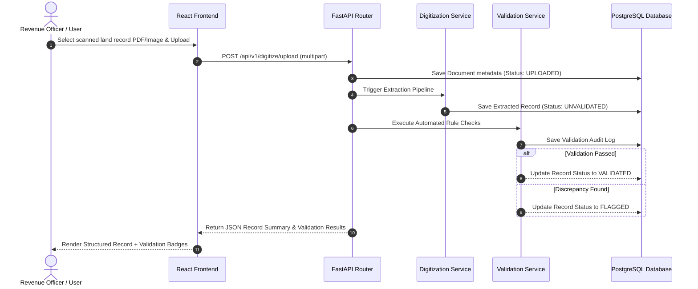

# Workflows & Data Pipelines — SIH26018

## Digitization & Cross-Validation Workflow

```mermaid
sequenceDiagram
    autonumber
    actor Officer as Revenue Officer / User
    participant FE as React Frontend
    participant API as FastAPI Router
    participant DS as Digitization Service
    participant VS as Validation Service
    participant DB as PostgreSQL Database

    Officer->>FE: Select scanned land record PDF/Image & Upload
    FE->>API: POST /api/v1/digitize/upload (multipart)
    API->>DB: Save Document metadata (Status: UPLOADED)
    API->>DS: Trigger Extraction Pipeline
    DS->>DB: Save Extracted Record (Status: UNVALIDATED)
    API->>VS: Execute Automated Rule Checks
    VS->>DB: Save Validation Audit Log
    alt Validation Passed
        VS-->>DB: Update Record Status to VALIDATED
    else Discrepancy Found
        VS-->>DB: Update Record Status to FLAGGED
    end
    API-->>FE: Return JSON Record Summary & Validation Results
    FE-->>Officer: Render Structured Record + Validation Badges
```
