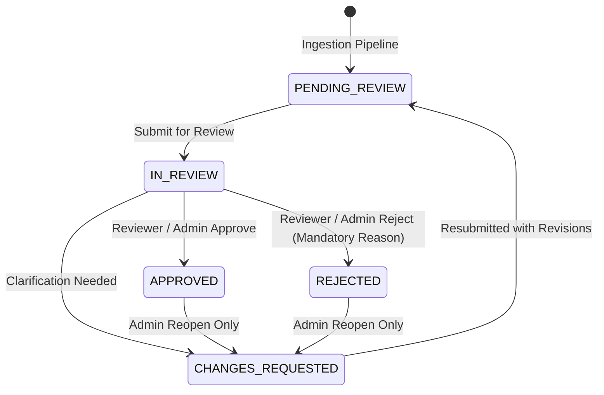

# Human Review and Approval Workflow Specification

## Separation of Concerns

The SIH26018 architecture strictly decouples automated data extraction and rule-based validation from authorized human governance:

1. **Extraction**: Machine-produced raw data (`MockExtractionProvider` / OCR).
2. **Normalization**: Canonical string, parcel number, and unit harmonization.
3. **Validation**: Automated deterministic rule verification (`VALIDATED` vs `FLAGGED`).
4. **Human Review**: Domain expert examination and discrepancy resolution.
5. **Approval**: Authorized legal acceptance by a Revenue Reviewer or Admin.

---

## 1. Review State Transition Machine

### Review States:

- **`PENDING_REVIEW`**: Initial state for all newly processed land records. Automated validation results (whether passed or flagged) are preserved alongside this review state.
- **`IN_REVIEW`**: A reviewer or operator has claimed or flagged the record for active human inspection.
- **`CHANGES_REQUESTED`**: Record sent back for re-survey, re-scan, or manual correction of discrepancies.
- **`APPROVED`**: Terminal state representing authorized legal acceptance.
- **`REJECTED`**: Terminal state representing fraudulent, unresolvable, or corrupt land records. Requires an explanatory rejection reason of at least 5 characters.

---

## 2. Review Endpoints

| HTTP Verb | Path | Permitted Roles | Description |
|---|---|---|---|
| `GET` | `/api/v1/records/{record_id}/review` | All Authenticated | Retrieve current review state, notes, and reviewer attribution |
| `POST` | `/api/v1/records/{record_id}/submit-review` | `OPERATOR`, `REVIEWER`, `ADMIN` | Submit record for review (`IN_REVIEW`) with inspection notes |
| `POST` | `/api/v1/records/{record_id}/approve` | `REVIEWER`, `ADMIN` | Officially approve land record (`APPROVED`) |
| `POST` | `/api/v1/records/{record_id}/reject` | `REVIEWER`, `ADMIN` | Reject land record with mandatory `rejection_reason` (`REJECTED`) |
